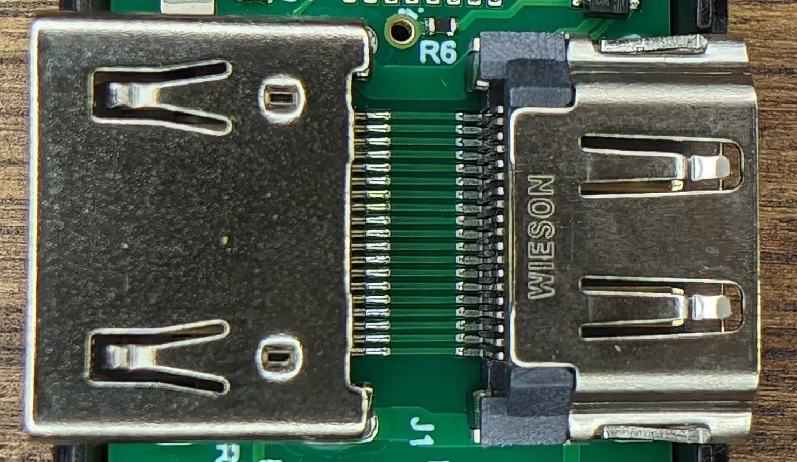
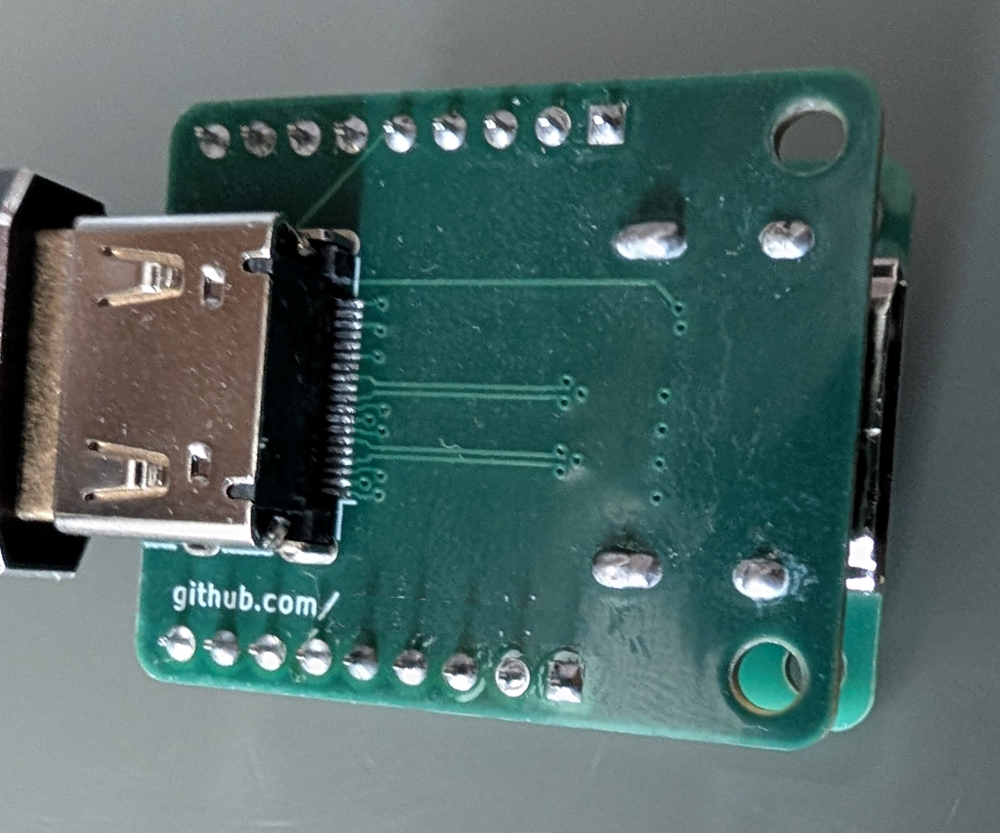

# CECLink

The CECLink is a small device that can be used to allow a Linux computer to control a TV using the CEC protocol over HDMI. This is particularly helpful for HTPCs, which often do not have the required hardware to do so built-in.

What's unique about this device is that it supports higher HDMI bandwidths. It is designed to work with and tested on a 4k, 10-bit HDR, 60FPS signal. This is done through following best practices for high-speed data lines.

While others devices look like this, and are made on a standard PCB (thanks [karl for the photo](https://karlquinsland.com/pulse-eight-hdmi-cec-injector-teardown/)):



This project's design, which looks a lot more random, is made on a controlled-impedance PCB and contains the secrets of the RF signal dark arts:



To be clear, this is not a secret technique! I would love to see others use this technique, and offer an updated commercial version of this device! All the details on how it works are in this source repo under `pcbs/`, and I would be happy to talk about it.

## Making your own

### PCB

The hardware is split across two KiCad projects under [`pcb/`](pcb). You will
need to have *both* these boards produced:

* [`pcb/hdmi-breakout`](pcb/hdmi-breakout) — the HDMI passthrough breakout that
  carries the CEC and DDC signals. This is a 4-layer board; order it with the
  **JLC04161H-7628 stackup**. Stackup is not a minor detail; incorrect stackup
  will destroy performance.
* [`pcb/rp2040-adaptor`](pcb/rp2040-adaptor) — a simple breakout for the RP2040-Zero
  that connects to the HDMI breakout. This is an ordinary **2-layer** board with
  no controlled-impedance requirement, so any standard stackup is fine.

Shared symbols and footprints live in [`pcb/library`](pcb/library). Gerber and
drill archives for each board can be generated with
[`jlcpcb_fab.py`](jlcpcb_fab.py).
The [latest release](https://github.com/flaviut/ceclink/releases/latest) has
ready-to-order Gerber and drill archives: `adapter.zip` for the RP2040 adapter
and `hdmi-breakout.zip` for the HDMI board.

Additional BOM (parts to source separately on top of the fabricated boards):

| Count | Part |
| ----- | ---- |
| 2 | HDMI Type-A receptacle (Molex 208658-1001, LCSC C138388) |
| 1 | Waveshare RP2040-Zero |
| 2 | 1×9 2.54mm male pin header strip |
| 2 | 1×9 2.54mm female header / socket strip |
| 2 | M3 × 16mm socket head cap screw |
| 2 | M3 nut |

Remember that you can easily cut a longer 2.54mm header to size with some snips.

### Initial flash

Download `firmware.uf2` from the
[latest release](https://github.com/flaviut/ceclink/releases/latest).

Hold the BOOT button while connecting the USB cable. Once powered, you should see a new drive on your computer. Copy-paste the `.uf2` file over, and your device should be flashed.

### Operating system integration

This project tries to make use of the operating system drivers for the bulk of the integration, but this is unfortunately not fully sufficient.

#### CLI alternative

```sh
picotool load -v -x ceclink.uf2
```

## Development

### Building

```sh
nix develop
cargo build --locked --profile release-with-debug
picotool uf2 convert target/thumbv8m.main-none-eabihf/release-with-debug/ceclink -t elf ceclink.uf2
```

If direnv is enabled in your shell, run `direnv allow` once in this directory to enter the flake dev shell automatically.

For a reproducible production artifact:

```sh
nix build .#firmware
ls result/ceclink.{uf2,elf}
```

Format the Nix and Rust sources with `nix fmt`.

## NixOS integration

Add this repository as a flake input and import `inputs.ceclink.nixosModules.default` on the host. The module loads the Pulse-Eight kernel driver, starts `inputattach` only for the CEC USB interface, creates `/dev/ceclink-status` for the status interface, and enables fwupd support.

The `ceclink-physical-address@` service reads the status interface and applies its DDC physical address to the matching `/dev/cec*` through the standard Linux CEC ioctl. It matches the devices by their shared USB parent, including when more than one adapter is connected. It retries when the CEC driver is still attaching and rechecks the kernel's address on every record. If firmware reports `65535` (unknown) for 2 seconds, the helper uses `ddcutil detect` to force a 256-byte EDID read across display buses, up to three attempts, while the firmware is listening. The firmware status confirms whether a read found the address. Known addresses must stay stable for 0.5 seconds; a short unknown interval during an EDID reread does not start another scan or clear a valid address. The NixOS module loads `i2c-dev` and supplies `ddcutil`. On other Linux distributions, install `pyserial` and `ddcutil`, load `i2c-dev`, and run `python3 nix/physical-address.py ttyACM1`, substituting the status TTY. The service needs access to the status TTY, the CEC device, and the HDMI I²C buses.

## fwupd on NixOS

The firmware exposes Raspberry Pi's USB reset interface alongside CDC ACM. fwupd's existing `rp-pico` plugin uses that interface to enter RP2350 BOOTSEL, then its `uf2` plugin writes the UF2 image. The overlay adds device matching for this adapter and the RP2350 ROM's `2e8a:000f` USB identity.

Rebuild the NixOS configuration, then flash a firmware containing the USB reset interface once using the manual method above. `fwupdmgr get-devices` should then show the adapter as updatable. A signed or local fwupd CAB containing the UF2 and release metadata is still required for `fwupdmgr update` to offer an update.

The runtime quirk selects fwupd's `rp-pico` plugin by VID:PID; that plugin also checks for the USB reset interface, which ordinary Pulse-Eight adapters lack. Increment the firmware's USB `device_release` for future firmware versions so fwupd can report the installed version. The RP2350 ROM BOOTSEL button remains a recovery path.

## Physical address status and DDC diagnostics

The second USB CDC ACM port is labeled `CECLink status`. On Linux, the persistent `/dev/serial/by-id/usb-CECLink_RP2350_HDMI_CEC_Adapter_<chip-id>-if00` link identifies the CEC port; `-if02` identifies status. While DTR is asserted, status sends a record immediately, when the address changes, and once per second. The stable format is exactly two tab-separated decimal fields; `65535` means unknown:

```text
status_version=1\tphysical_address=4096
```

The separator on the wire is a tab. For a verbose snapshot, send `diagnostics\n` to the status port. It returns one record with `version=1`, GPIO levels, PIO traces, counters, and the current address. This diagnostic record is separate from the supported status format. For example:

```text
version=1\tuptime_ms=1234\tsda=1\tscl=1\tring_used=0\tring_peak=4\tstarts=2\tstops=2\twords=12\tfifo_stalls=0\tring_overflows=0\ttrace_len=2\ttrace_0=0\ttrace_1=0\tedid_write_addresses=1\tedid_read_addresses=1\tedid_bytes=8\tinvalid_words=0\tunacknowledged_addresses=0\tpio_pc=7\trx_empty=1\trx_full=0\tphysical_address=4096
```

Stop `ceclink-physical-address@<status-tty>.service` before opening the status port directly. The CEC control port remains available to `inputattach` while the helper uses status.

For a future driver, the CEC control port also supports the CECLink `GET_SNIFFED_PHYSICAL_ADDRESS` command (`0x30`). Send the normal Pulse-Eight frame `ff 30 fe`; the response is `ff 30 <address-high> <address-low> fe`, using the normal escape rules for bytes `fd` through `ff`. This returns the raw DDC address, including `ffff` when unknown, regardless of any host-set physical address. The stock driver does not send this command.

The onboard RGB LED uses GPIO22 for data and GPIO23 for power. Blue means the firmware is running but has not captured a DDC START. Amber means DDC traffic was captured but no physical address was found. Red means a FIFO stall or SRAM ring overflow occurred. Green means the physical address was found. The serial diagnostics give the exact counters and GPIO levels.

For an active EDID read from the HDMI connector, use `nix run nixpkgs#ddcutil -- --edid-read-size=256 --disable-try-get-edid-from-sysfs detect` while the adapter is in the HDMI path. Compare counter values before and after the read.

## Connections

| XIAO pin | RP2350 GPIO | Role |
| --- | ---: | --- |
| D9 | GPIO4 | Bidirectional CEC, open drain |
| D4 | GPIO6 | DDC SDA input only |
| D5 | GPIO7 | DDC SCL input only |

D4 and D5 are receive-only GPIO inputs, not I²C master pins. Use a 100kΩ resistor between the HDMI bus and the RP2350.
